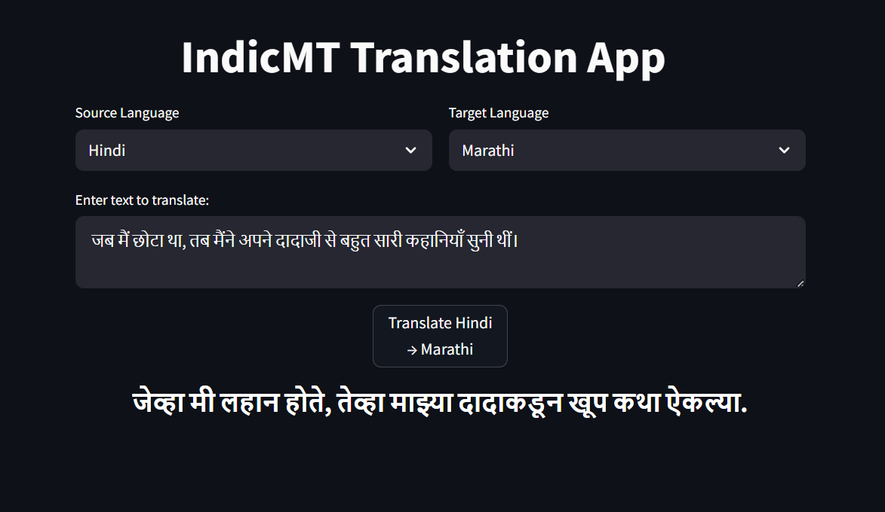

# Indic Machine Translation (IndicMT)

This repository provides code and resources for **Multilingual Indic Machine Translation (MT)** developed using the **OpenNMT-py** framework. The project focuses on building high-quality, **compact, efficient, and cost-effective models** that can be easily used by everyone—including on CPUs—to enable translation across a broad range of Indic languages.

---

## Introduction

India is home to a rich and diverse linguistic landscape, with hundreds of languages spoken nationwide. However, many Indic languages remain underrepresented in existing machine translation systems. IndicMT aims to bridge this gap by developing translation models for **10 languages**—English plus nine major Indic languages: Hindi, Bengali, Gujarati, Kannada, Marathi, Punjabi, Sanskrit, Tamil, and Urdu.

The initial phase focuses on an **English-centric multilingual model** that jointly trains English-to-Indic and Indic-to-English translation pairs within a single unified model. This approach leverages the comparatively abundant English-Indic parallel data and establishes a robust foundation for developing more advanced multilingual and direct Indic-to-Indic translation systems.

A key objective is to create **smaller, faster, and more affordable models** that can be deployed on commodity hardware, including CPUs, removing the barrier of requiring expensive GPUs and thereby broadening accessibility.

By unifying multiple languages within a shared framework, IndicMT facilitates research, promotes cultural exchange, and advances NLP capabilities for low-resource Indic languages.

---

## Data

The training and evaluation datasets primarily come from the **BPCC** corpus—a widely recognized, comprehensive multilingual resource for Indic languages. To ensure data quality, the corpus is filtered using a **LaBSE (Language-agnostic BERT Sentence Embedding)** similarity threshold of **≥ 0.85**, wherever applicable, resulting in clean and well-aligned parallel sentence pairs.

---

## Supported Languages

- English  
- Hindi  
- Bengali  
- Gujarati  
- Kannada  
- Marathi  
- Punjabi  
- Sanskrit  
- Tamil  
- Urdu  

---

## Training Details

- Initial training is conducted on a single multilingual model having English-to-Indic and Indic-to-English language pairs.  
- The OpenNMT-py framework powers all model training and inference.  
- LaBSE-based filtering (≥ 0.85 similarity) is applied wherever applicable to maintain dataset quality by ensuring strong sentence alignment.

### Training Environment

The training process was carried out using a multi-GPU setup with 4 GeForce RTX 2080 Ti GPUs, enabling parallel processing to handle the extensive computational requirements of training the multilingual model. The training spanned 5 days, during which the GPUs played a crucial role in accelerating performance and optimizing resource usage.

Below is a sample of the GPU utilization during the training process:

---

## Indic-to-Indic Translation

- Currently, Indic-to-Indic translation is handled using a **cascaded pivot approach**:  
  1. Translate the source Indic language to English.  
  2. Translate English into the target Indic language.  
- Future development will focus on **direct Indic-to-Indic translation models** leveraging smaller, efficient architectures that improve translation quality while enabling fast inference on limited hardware.

---

## User Interface

A simple web-based interface is included for testing translation models. Below are sample screenshots demonstrating the interface and example translations:

- **Interface Overview**  
  

- **English → Hindi**  
  

- **Hindi → English**  
  

- **English → Tamil**  
  

- **English ↔ Punjabi**  
  

- **Hindi → Marathi**  
  

*Note: These examples were generated using a model trained for 240k steps (approximately 1.2 epoch).*

---

## Ongoing and Future Work

This is an ongoing effort to democratize Indic language translation by building models that are **accessible, efficient, and scalable**. The next phase will focus on developing **direct Indic-to-Indic translation models** using smaller, faster architectures optimized for deployment on CPUs and low-resource environments.

---

